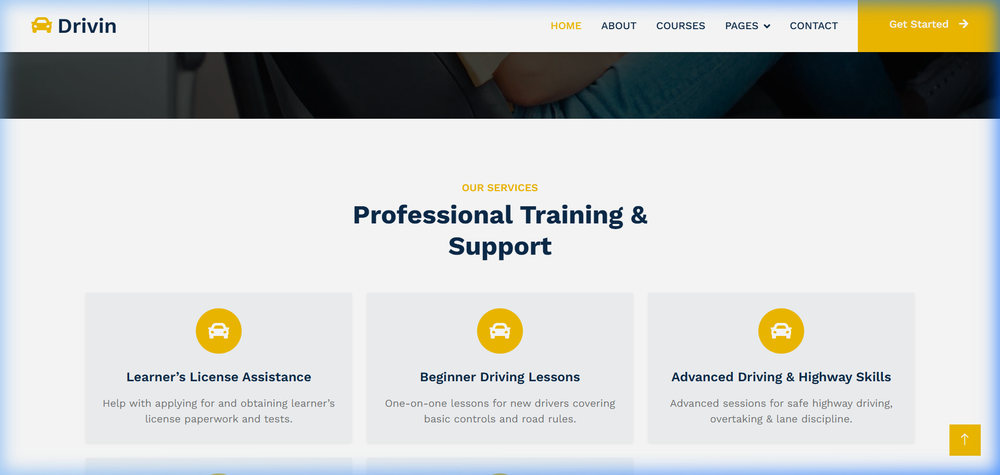

# Driv_in - Backend System 🚗🔧

This repository contains the backend infrastructure for the **Driv_in** platform, built specifically to provide robust content management, APIs, and service handling. As a backend-focused architecture, it separates business logic into modular Django apps and relies on Django Rest Framework for potential API extensions.

## 🚀 Preview



## 🛠️ Tech Stack & Architecture

- **Framework**: Django (Python)
- **API**: Django Rest Framework (DRF)
- **Database**: SQLite3 (Default, easily swappable to PostgreSQL/MySQL)
- **Email Backend**: SMTP Configuration (Gmail)
- **Environment**: Virtual Environment setup recommended

## 📂 Modular App Structure

The platform is designed with a monolithic and modular structure, utilizing several integrated Django apps for separation of concerns:
- `mainapp`: Handles core views and routing.
- `services`: Manages service offerings and dynamic data.
- `contactdetail`: Processes contact forms and user inquiries.
- `blogpanel`: Manages the blogging engine and articles.
- `courses`: Registers and displays available courses.
- `team`: Manages team member portfolios.
- `testimonial`: Handles customer reviews and feedback.
- `myapi`: dedicated app for REST APIs exposed via Django Rest Framework.

## 💻 Running Locally

Follow these steps to get the development environment running locally:

1. **Clone the repository:**
   ```bash
   git clone https://github.com/nileshrathore22/driv_in.git
   cd driv_in
   ```

2. **Set up a Virtual Environment:**
   ```bash
   python -m venv env
   # Activate the environment
   # Windows:
   env\Scripts\activate
   # macOS/Linux:
   source env/bin/activate
   ```

3. **Install Dependencies:**
   Since there might not be a `requirements.txt` initially, ensure you install the core dependencies:
   ```bash
   pip install django djangorestframework Pillow
   ```
   *(Note: `Pillow` is required for any `ImageField` models used in apps)*

4. **Apply Migrations:**
   ```bash
   python manage.py makemigrations
   python manage.py migrate
   ```

5. **Run the Development Server:**
   ```bash
   python manage.py runserver
   ```
   The backend dashboard and site will be accessible at `http://127.0.0.1:8000/`.

## ⚙️ Backend Focus Notes

- **Modularity:** The project relies on multiple decoupled apps which makes the codebase highly scalable from a backend perspective.
- **API First:** The inclusion of `djangorestframework` inside the installed apps suggests the implementation of RESTful endpoints to consume data securely from external frontends or native apps.
- **Media & Static Handling:** The system comes fully configured with `STATIC_URL`, `STATICFILES_DIRS`, `MEDIA_ROOT`, and `MEDIA_URL` locally, ensuring user uploads (like profile images or blog banners) are properly stored and served.

---
*Maintained by nileshrathore22*
